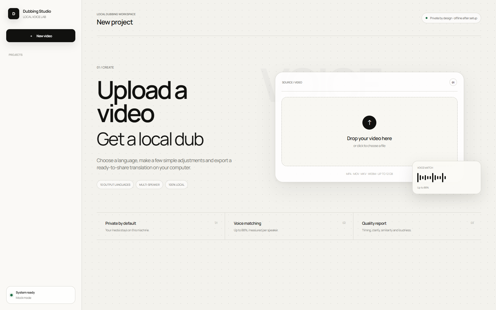

# Dubbing Studio Local

A fully local workspace for translating and professionally dubbing video. Dubbing Studio transcribes speech, separates voices from the original mix, translates each line, generates native pronunciation, matches each speaker’s vocal profile, fits the performance to the original timing and exports a finished video.

> **Public alpha — `v0.1.0-alpha.1`.** The core workflow is usable, but installation and output quality still need broader hardware and language testing. Keep the original media, review every export and report reproducible issues without attaching private video or voice data.

After the first setup, inference runs on your computer. Source videos and voice samples are not sent to a cloud API.

> Clone only your own voice or a voice you have explicit permission to use. Never use this software for deception, impersonation, fraud or identity-verification bypass.



## What it does

- Imports MP4, MOV, MKV, WebM and M4V files up to 12 GB.
- Detects the source language and number of speakers automatically or accepts manual values.
- Lets you correct the transcript and punctuation before translation.
- Translates locally with Tencent Hy-MT2.
- Builds a separate voice profile for every speaker and reports similarity; clean sources can reach up to 88%.
- Offers previewable catalog voices for single-speaker videos when cloning is not needed.
- Automatically keeps the source resolution, frame rate, visual-quality target and original background mix; no codec or mixing decisions are required.
- Offers optional local lip synchronization. It is off by default for faster renders; when enabled, the studio keeps a recoverable pre-lip-sync master and never replaces the accepted audio mix.
- Edits captions in Export: disable them, choose one of six Manrope treatments, set size/color/scale, or drag them to an exact on-video position; caption-only changes reuse the completed dub instead of rerunning translation or voice models.
- Checks duration, recognition coverage, voice similarity, boundaries, peaks, loudness and output decoding.
- Shows quality measurements and advisory notices without blocking a finished export.
- Keeps versioned MP4 and SRT exports instead of overwriting an earlier render.
- Recovers queued work after a restart and marks an interrupted active stage for a safe retry.
- Shows live model, line and pass progress with a smoothly advancing percentage instead of coarse stage jumps.
- Stops queued or active processing on demand; deleting a busy project cancels its complete model-process tree before removing local files.
- Works offline after the complete first installation.

## System requirements

### Windows

| Component | Minimum | Recommended |
|---|---:|---:|
| OS | Windows 10/11 | Current Windows 11 |
| GPU | NVIDIA with 12 GB VRAM | RTX 4080 / 4080 Super or better, 16 GB+ |
| System memory | 24 GB | 32 GB+ |
| Free storage | 45 GB | 55 GB+ plus project storage |
| Driver | Recent NVIDIA driver | NVIDIA Studio Driver |

### macOS — Apple Silicon experimental alpha

| Component | Minimum | Recommended |
|---|---:|---:|
| Mac | M1 or newer, Apple Silicon only | M2 Pro/Max or newer |
| macOS | macOS 14 Sonoma | Current macOS |
| Unified memory | 16 GB, Hy-MT2 1.8B | 32 GB+, Hy-MT2 7B |
| Free storage | 35 GB | 50 GB+ plus project storage |

Intel Macs, AMD/Intel Windows GPUs and Linux are not supported by the automatic production installers. Internet is required only for the initial dependency and model download. The models occupy roughly 25–35 GB depending on the Mac translation profile.

## Installation for complete beginners

### 1. Download the project

On GitHub, select **Code → Download ZIP**, then extract the archive to a normal folder such as:

```text
F:\Dubbing-Studio
```

Do not run the application from inside the ZIP and do not place it in `Program Files`.

Git users can clone it instead:

```powershell
git clone https://github.com/amirmushichge/dubbing-studio-local.git
cd dubbing-studio-local
```

### 2. Run automatic setup on Windows

Double-click **`setup.bat`** and wait for the green success message. Setup will:

1. check Windows, disk capacity and NVIDIA support;
2. install missing Git, Python 3.10, FFmpeg and SoX through `winget` or pinned fallback installers;
3. create isolated Python environments;
4. download tested revisions of Qwen3-TTS, Hy-MT2, faster-whisper, Demucs, Seed-VC and MuseTalk lip sync;
5. run diagnostics;
6. create a desktop shortcut.

Windows may ask for permission to install prerequisites. If the connection is interrupted, run `setup.bat` again: model downloads resume instead of starting over.

### 3. Start the studio

Double-click **`start.bat`** or the **Dubbing Studio** desktop shortcut. Your browser opens:

```text
http://127.0.0.1:8765
```

This is a private address on your own computer, not a public website. Keep the server window open while a project is processing. Close it or press `Ctrl+C` to stop the studio.

## Installing on an Apple Silicon Mac

1. Download and extract the project into a normal folder such as `~/Applications/Dubbing-Studio`. Do not run it inside the ZIP.
2. In Finder, double-click **`setup.command`**. If macOS blocks the first launch, Control-click the file, select **Open**, then confirm **Open**.
3. If Apple asks to install Command Line Tools, finish that installation and double-click `setup.command` again.
4. Keep the Terminal window open while Homebrew, Python environments and the local models are installed. Interrupted model downloads resume when setup is run again.
5. After the green success message, double-click **Dubbing Studio.command** on the Desktop or `start.command` in the project folder.

If a ZIP extractor removed the executable permission and double-clicking shows `Permission denied`, open Terminal, type `/bin/bash ` (including the final space), drag `setup.command` into the Terminal window and press Return. Setup restores executable permissions for all three Mac launchers.

The installer detects unified memory automatically. Macs with 32 GB or more receive Hy-MT2 7B; 16–24 GB Macs receive Hy-MT2 1.8B to avoid memory exhaustion. Speech recognition runs locally on the CPU, while Demucs, Qwen3-TTS, Hy-MT2 and Seed-VC use Apple Metal where supported. Video export uses Apple VideoToolbox.

The Apple Silicon build shares the same projects and interface as Windows, but it remains experimental until the full reference-video quality suite has been repeated on physical M1/M2/M3/M4 machines. Always review the complete result before delivery.

The current MuseTalk lip-sync engine requires NVIDIA CUDA. On Apple Silicon the same toggle is shown but disabled with a clear availability message; dubbing, timing alignment, voices, captions and export remain local and fully available.

## Creating a dub

1. Drop a video onto the home screen or choose a file.
2. Select the source language or leave automatic detection enabled.
3. Select the number of speakers or leave it on automatic.
4. Start the analysis.
5. Review the transcript, punctuation and speaker assignments. These corrections directly affect translation and delivery.
6. Select the output language.
7. Choose a voice mode:
   - **Match source voices** aims to retain a separate timbre and manner for each person; similarity depends on the source;
   - **Choose a new voice** creates a catalog voice for a single-speaker video.
8. Optionally enable **Lip sync** next to **Create dub** when visible mouth movement should be regenerated. Leave it off for faster processing or footage without a clearly visible speaking face.
9. Create the dub. The studio automatically uses a natural delivery, keeps the original background mix and matches the export resolution, frame rate and visual-quality target to the source.
10. In Export, enable or disable captions. If enabled, select a visual treatment, size and color from the live previews, then position and scale them directly over the video.
11. Review the quality report. Quality notices are advisory: MP4 and SRT remain downloadable, and voice similarity is always informational.

Recommended starting point: Match source voices and create the dub. Caption styling remains optional in Export.

## Output languages

| Code | Language |
|---|---|
| `zh` | Chinese, Simplified |
| `en` | English |
| `ru` | Russian |
| `de` | German |
| `fr` | French |
| `es` | Spanish |
| `it` | Italian |
| `pt` | Portuguese |
| `ja` | Japanese |
| `ko` | Korean |

Source transcription supports more languages, but production output is restricted to the tested intersection of the translator and speech synthesizer. Bosnian is not in the validated set yet; it requires separate TTS, pronunciation and quality calibration.

## How the pipeline works

```text
video
  → FFmpeg extracts audio
  → Demucs separates speech from the original mix
  → faster-whisper transcribes words and timing
  → voice embeddings group individual speakers
  → Hy-MT2 translates while preserving punctuation
  → Qwen3-TTS creates native target-language pronunciation
  → Seed-VC matches each source voice profile
  → lines are fitted to the original time slots
  → FFmpeg mixes background, voices and captions
  → automated QA validates the result
```

The two-stage voice design is intentional. Direct cross-language voice conversion can preserve the source accent and destabilize identity. Qwen first creates native pronunciation; Seed-VC then transfers the original timbre onto that performance.

## Project files

```text
Dubbing-Studio/
├─ app/                 web server and orchestration
├─ static/              English AmirStyle interface
├─ workers/             ASR, translation, TTS, voice conversion and QA
├─ runtime/             environments and models created by setup.bat or setup.command
├─ data/projects/       sources, intermediate files and exports
├─ logs/                setup logs
└─ tests/               lightweight automated tests
```

`runtime/`, `data/`, `output/`, `logs/`, `deliveries/` and `checkpoints/` are excluded from Git. To keep projects on another drive, copy `.env.example` to `.env` and set `DUBBING_STUDIO_DATA`. To place models elsewhere, set `DUBBING_STUDIO_RUNTIME` **before the first setup**.

Every successful render receives a unique ID and remains in the project’s `output/` directory. Editing a completed transcript archives the current result and returns the project to Review so stale media cannot be presented as current. The `exports` array in `project.json` records the version history.

## Updating and uninstalling

Git installations can run **`update.bat`**. It pulls the latest commit and safely reapplies setup. ZIP users can download the latest archive and run `setup.bat` again.

To uninstall, save any exports you need from `data/projects`, then delete the Dubbing Studio folder and desktop shortcut. Dubbing Studio does not install a background service. Git, Python and FFmpeg remain installed because other applications may use them.

## Diagnostics and troubleshooting

Run `doctor.ps1` on Windows or `doctor.command` on macOS. Every required runtime, model, FFmpeg and hardware-acceleration check should report `OK`.

| Problem | Resolution |
|---|---|
| SmartScreen blocks BAT/PS1 | Select **More info → Run anyway** only if the project came from the trusted repository. |
| macOS blocks a `.command` file | Control-click it in Finder, select **Open**, then confirm. Do this only for a trusted copy. |
| Apple Command Line Tools are requested | Finish the Apple installer, then run `setup.command` again. |
| A 16–24 GB Mac selects the smaller translator | This is intentional to prevent memory exhaustion. A 32 GB+ Mac uses Hy-MT2 7B. |
| `winget` is unavailable | Setup uses pinned direct installers for Python, Git and FFmpeg. |
| NVIDIA is not detected | Install the latest NVIDIA Studio Driver, restart Windows and verify `nvidia-smi`. |
| Not enough storage | Free at least 45 GB on the runtime drive or set `DUBBING_STUDIO_RUNTIME`. |
| A download was interrupted | Run `setup.bat` again; Hugging Face continues incomplete files. |
| Port 8765 is in use | If Dubbing Studio is already running, the script opens it. Otherwise stop the process using that port. |
| A task was queued when the app closed | Start Dubbing Studio again; queued tasks are restored automatically. A task interrupted mid-model is marked Failed so it can be retried safely. |
| A quality notice is shown | The finished video remains downloadable. Review the notice and render another version only when the measured issue matters for delivery. Voice similarity is always informational. |
| The dub has a source accent | Verify the target language, preserve the original voice, correct punctuation and avoid maximum expression. |
| Voice identity changes | Verify speaker count and assignments. Longer clean speech references produce more stable identities. |
| Clicks or noise are audible | Reduce the background level and review QA warnings. Clean source dialogue produces the best result. |
| A line cannot fit naturally | Retry the dub. The timing adapter automatically tries shorter translations and alternate delivery passes before reporting a line-specific error. |
| Caption characters are wrong | Use the generated UTF-8 BOM SRT and a modern video player. |

Project logs are stored in `data/projects/<ID>/logs`. When reporting an issue, attach the output from `doctor.ps1` or `doctor.command` and the relevant text log, never private video or voice samples.

## UI development without models

Use mock mode to test the interface and workflow without downloading AI models:

```powershell
$env:DUBBING_STUDIO_MOCK='1'
.\start.ps1
```

On macOS:

```bash
DUBBING_STUDIO_MOCK=1 ./start.command
```

Mock mode validates uploads, navigation and test exports. It does not measure real AI quality.

## Development

```powershell
py -3.10 -m venv .venv
.\.venv\Scripts\python.exe -m pip install -r requirements.txt -r requirements-dev.txt
.\.venv\Scripts\python.exe -m pytest -q
node --check static\app.js
```

macOS uses `.venv/bin/python` instead of `.venv\Scripts\python.exe`.

The API is built with FastAPI. Main routes include `/api/health`, `/api/catalog`, `/api/projects`, `/analyze`, `/render` and `/ws/projects/{id}`. One heavy GPU task runs at a time so translation, synthesis and conversion models do not compete for VRAM.

All external repositories and model weights are pinned to tested revisions in `setup.ps1` and `tools/download_models.py`. GitHub Actions does not download large models; CI tests Python and JavaScript on Windows and macOS, parses both launcher families, audits Python dependencies and scans the Git history for secrets.

## Privacy and limitations

- Inference is local after setup; GitHub and Hugging Face are contacted only to download dependencies and models.
- Project data is not encrypted at rest. Any Windows user with access to `data/projects` can read it.
- Quality depends on source cleanliness, overlapping speech, line duration, language and available VRAM.
- The application does not guarantee perfect identity, emotion or lip synchronization.
- The macOS build is experimental and lip synchronization currently requires Windows with NVIDIA CUDA.
- Always review the complete result and respect rights to the video, music, translation and voice.

## Licenses and credits

The original interface and orchestration code use the MIT License. Setup downloads independent third-party components under their own terms:

- Qwen3-TTS — Apache-2.0;
- Tencent Hy-MT2 — Apache-2.0;
- faster-whisper — MIT;
- Demucs — MIT;
- Seed-VC — GPL-3.0;
- Linly-Dubbing — Apache-2.0, used as a workflow research reference rather than a required runtime component;
- Manrope — SIL Open Font License 1.1.

See [THIRD_PARTY_NOTICES.md](THIRD_PARTY_NOTICES.md) for source links and pinned revisions.

## FAQ

**Is Codex required after installation?** No. The complete workflow runs from the local web interface.

**Is the internet required for every project?** No. Models work offline after complete setup.

**Can multiple videos process at once?** Projects may be imported in advance, but heavy GPU work runs sequentially.

**Can captions be disabled?** Yes. You can also save SRT without burning captions into the video.

**Which voice mode should I use?** Match source voices for multi-speaker video or when vocal similarity matters. Use a catalog voice when similarity is not required and the video has one speaker.

**Why is setup so large?** Recognition, translation, native speech generation, voice conversion and music separation use specialized local models.
